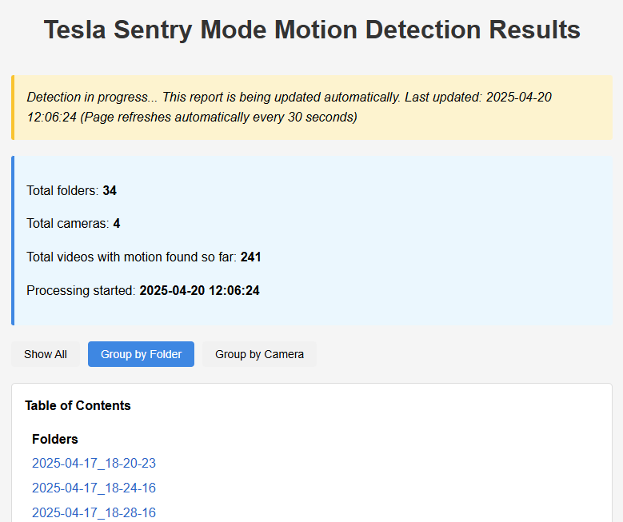
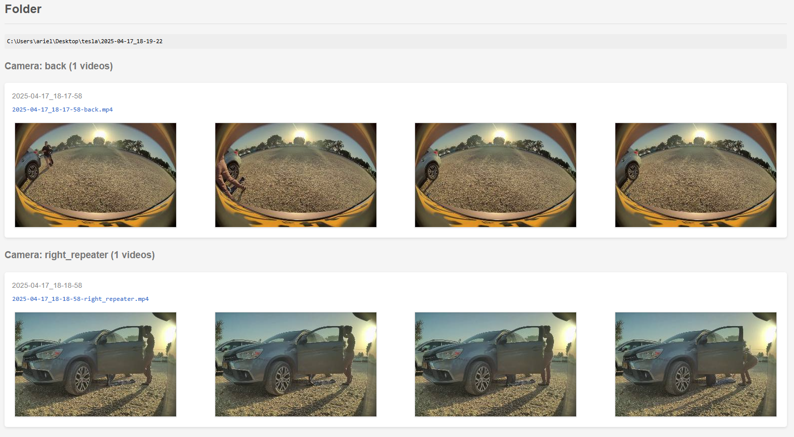
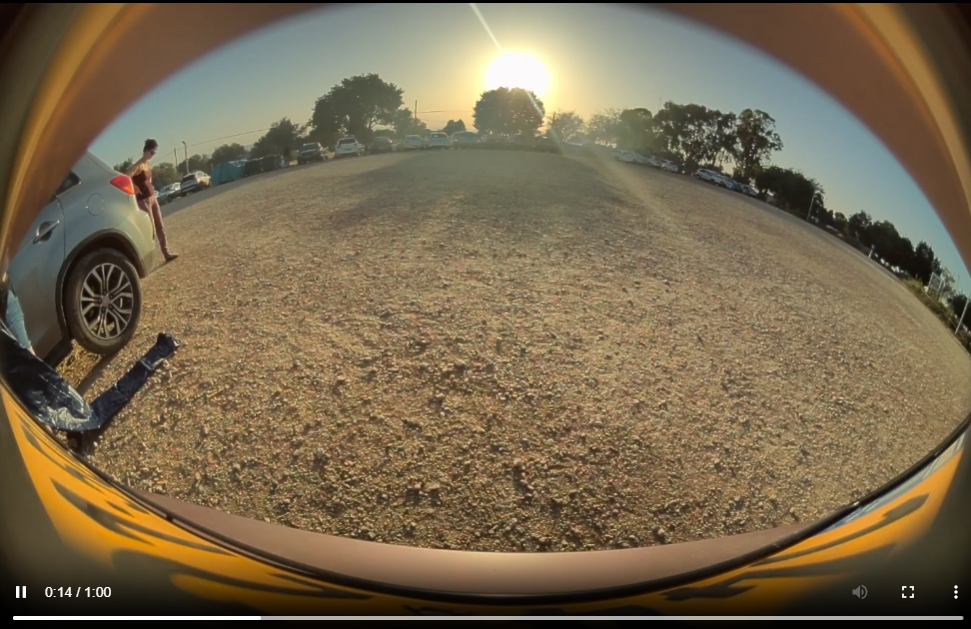
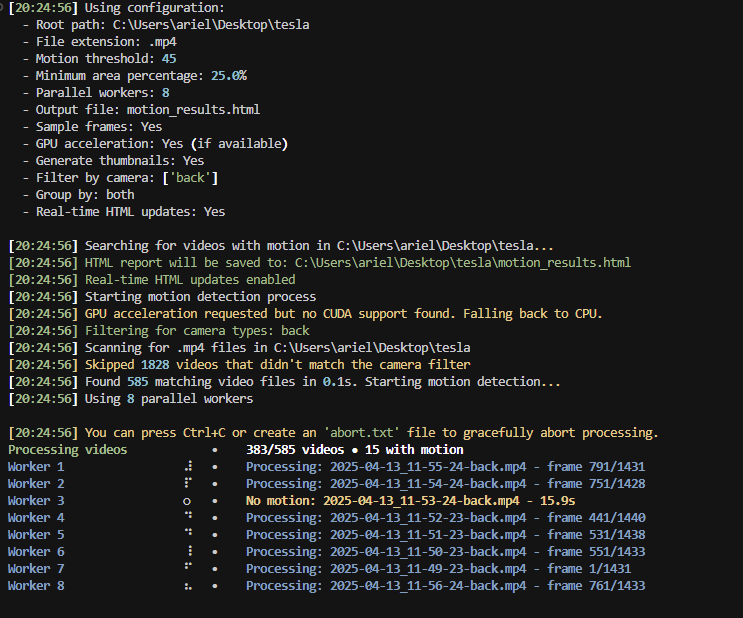

# A collection of powerful tools for analyzing Tesla Sentry Mode footage
1. **detect_motion_videos.py**: Identifies videos containing significant motion with visual HTML reports
2. **analyze_tesla_sentry.py**: Analyzes event.json files to understand trigger reasons and camera statistics

*Because sorting through 80GB of footage to find who dented your car shouldn't require a weekend and three energy drinks.*

## The Origin Story
After discovering two mysterious holes in my Tesla's trunk after camping and Sentry Mode providing me with excellent footage of... everything except the actual incident, I built this tool out of pure desperation.

## What This Actually Does
- Analyzes Tesla Sentry Mode footage using motion detection algorithms
- Creates an interactive HTML report with video thumbnails
- Prioritizes videos with significant motion (because you probably don't need 20 clips of someone checking their phone near your car)
- Multi-threaded processing to save your sanity
- GPU acceleration so you can still use your computer while it crunches through videos
- Progress tracking with x/y counter so you know how much longer your coffee break should be

## Screenshots

### Interactive HTML Report
The HTML report displays all videos with significant motion, organized by folder and camera type:



Videos are displayed with thumbnails for easy visual identification:



Filter controls allow you to switch between folder and camera views:



### Video processing progress
Multi-threaded processing with live progress tracking:



## Known Tesla Sentry Mode Quirks
- Apparently, the rear camera doesn't trigger events (discovered the hard way)
- No prioritization of events (a leaf blowing by = same urgency as your car being hit)
- Excessive triggering leading to footage overload

## Features

### Motion Detection (detect_motion_videos.py)
- **Motion Detection**: Analyzes videos to find those with substantial motion
- **GPU Acceleration**: Uses CUDA GPU acceleration when available for faster processing
- **Interactive HTML Reports**: Creates beautiful, interactive reports with:
  - Video thumbnails extracted automatically
  - Organization by folder and camera type
  - Filtering options for easier navigation
  - Real-time updates during processing
  - Status indicators showing progress and completion
  - Timestamp showing when the report was last updated
  - Portable with relative paths - move the entire folder anywhere
- **Multi-threaded**: Processes multiple videos in parallel
- **Camera Detection**: Automatically identifies camera types (front, back, left_repeater, right_repeater)
- **Customizable**: Multiple threshold and sensitivity options
- **Auto-Refresh Control**: Toggle button to start/stop auto-refresh in the browser
- **Advanced Logging**: Detailed logging to diagnose progress or issues
- **Improved Error Handling**: Consistent error reporting and handling

### Event Analysis (analyze_tesla_sentry.py)
- **Event Statistics**: Counts events by camera type and trigger reason
- **Folder Tracking**: Lists all folders containing events for each camera
- **Reason Analysis**: Identifies common trigger reasons for Sentry Mode events
- **Simple Output**: Generates both console output and a text file summary

## Installation

1. Clone this repository:
   ```
   git clone <repository-url>
   cd <repository-directory>
   ```

2. Install dependencies:
   ```
   pip install -r requirements.txt
   ```

3. Make sure you have OpenCV and its dependencies installed properly. For GPU acceleration, you'll need CUDA and OpenCV built with CUDA support.

## Usage

### Motion Detection Tool

Basic usage:

```
python detect_motion_videos.py /path/to/sentry/footage
```

This will:
1. Scan all MP4 files in the specified directory and its subdirectories
2. Analyze each video for significant motion
3. Generate an HTML report with videos organized by camera type and folder
4. Create thumbnails for each video with motion

#### Command Line Options for Motion Detection

```
python detect_motion_videos.py --help
```

Key options:

- `--threshold <value>`: Sensitivity for motion detection (0-255, default: 45)
- `--min-area <value>`: Minimum percentage of frame with motion (default: 2.5%)
- `--workers <num>`: Number of parallel processing threads (default: 8)
- `--output <filename>`: Output HTML report filename (default: motion_results.html)
- `--no-gpu`: Disable GPU acceleration
- `--no-sample-frames`: Process all frames instead of sampling for higher accuracy
- `--filter-camera <type>`: Filter by camera type (front, back, left_repeater, right_repeater)
- `--group-by <option>`: Group by folder, camera, or both (default: both)
- `--no-realtime`: Disable real-time HTML updates during processing

#### Example Commands for Motion Detection

Filter for multiple camera types:
```
python detect_motion_videos.py /path/to/sentry/footage --filter-camera front back
```

Higher sensitivity, more workers:
```
python detect_motion_videos.py /path/to/sentry/footage --threshold 30 --min-area 1.5 --workers 12
```

Group only by camera type:
```
python detect_motion_videos.py /path/to/sentry/footage --group-by camera
```

### Event Analysis Tool

Basic usage:

```
python analyze_tesla_sentry.py /path/to/TeslaCam
```

This will:
1. Search through all subdirectories looking for event.json files
2. Compile statistics about which cameras triggered events and why
3. Display results in the console
4. Save results to SentryModeAnalysis.txt in the specified directory

#### Sample Output

```
=== Camera Event Counts ===

camera front: 12 events
2023-03-15_14-22-33,2023-03-16_09-45-12,2023-03-18_17-30-05

camera left_repeater: 8 events
2023-03-14_18-10-44,2023-03-15_20-05-22,2023-03-17_12-33-56

=== Reason Counts ===

reason user_interaction: 5 times
reason sentry_aware_object_detection: 15 times
```

## How It Works

### Motion Detection (detect_motion_videos.py)

1. **File Discovery**: Scans the specified directory (and subdirectories) for MP4 files
2. **Motion Analysis**: For each video:
   - Extracts frames (sampling for efficiency)
   - Applies Gaussian blur to reduce noise
   - Calculates frame differences to detect motion
   - Applies thresholds to filter small movements
3. **HTML Generation**: Creates an HTML report with:
   - Thumbnails extracted from each video
   - Links to the original files
   - Organization by folder and camera type

### Event Analysis (analyze_tesla_sentry.py)

1. **JSON Discovery**: Scans all subdirectories looking for event.json files
2. **Data Extraction**: Parses each JSON file to extract:
   - Which camera triggered the event
   - The reason for the event (e.g., sentry_aware_object_detection)
   - The containing folder name
3. **Statistical Analysis**: Compiles counts and folder lists for:
   - Events by camera type
   - Events by trigger reason

## Notes

- For Tesla Sentry Mode footage, a threshold of 30-50 and min-area of 2-3% typically works well
- GPU acceleration provides significant performance improvement
- Generated HTML report can be opened in any browser
- The event analysis tool is particularly useful for understanding why Sentry Mode is triggering

## Troubleshooting

### Stopping HTML Auto-Refresh

The HTML report includes an improved auto-refresh control system:

1. **Using the toggle button**:
   - The HTML report includes a "Stop Auto-Refresh" button at the top
   - Click this button to stop the automatic refreshing
   - The button will change to "Start Auto-Refresh" allowing you to resume refreshing
   - Your preference is saved between sessions using the browser's local storage

### Aborting Processing

You can abort the processing gracefully in two ways:

1. **Keyboard Interrupt**:
   - Press Ctrl+C in the terminal where the script is running
   - The script will stop submitting new videos for processing
   - Current videos being processed will finish
   - All results found so far will be saved to the HTML report

2. **Abort File**:
   - Create a file named `abort.txt` in the same directory as the script
   - The script checks for this file periodically
   - When detected, it will gracefully shutdown and save results
   - This is useful for remote or background processing

If you press Ctrl+C or create an abort file twice, the script will force an immediate exit without saving.

### If Processing Gets Stuck

If the motion detection process seems to get stuck:

1. **Check the log file**:
   - The script creates a detailed log file at `motion_detection_log.txt` in the current directory
   - This log contains information about each video being processed and any errors

2. **Add more logging**:
   - Use the `--verbose-logging` option to enable more detailed logs
   - This will log every step of the process, including frame analysis

3. **Resume processing**:
   - If the process was interrupted, you can resume using the `--resume` flag
   - This will skip videos that were already processed

4. **Reduce workload**:
   - Try processing a smaller batch with `--limit <number>` to process only N videos
   - Decrease worker count with `--workers 4` to reduce parallel processing

Common issues and solutions:
- **Corrupt video files**: Check the log file for any videos that couldn't be opened
- **Memory issues**: Lower the number of parallel workers or use `--no-thumbnails`
- **GPU problems**: Add `--no-gpu` to disable GPU acceleration if issues persist

## License

MIT License

## Acknowledgments

- These tools were created out of necessity after discovering the limitations of Tesla's Sentry Mode
- Built with OpenCV, a powerful computer vision library
- With hopes that Tesla might someday improve their event filtering (and actually trigger on rear camera events!) 